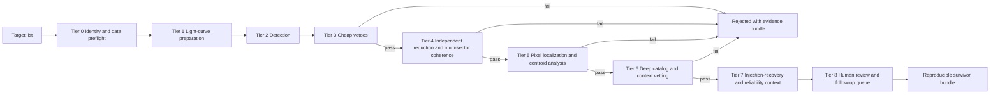
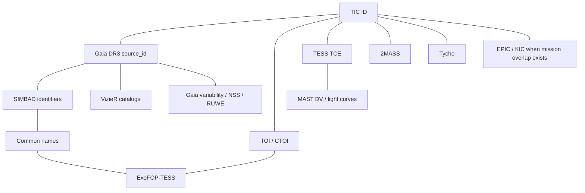
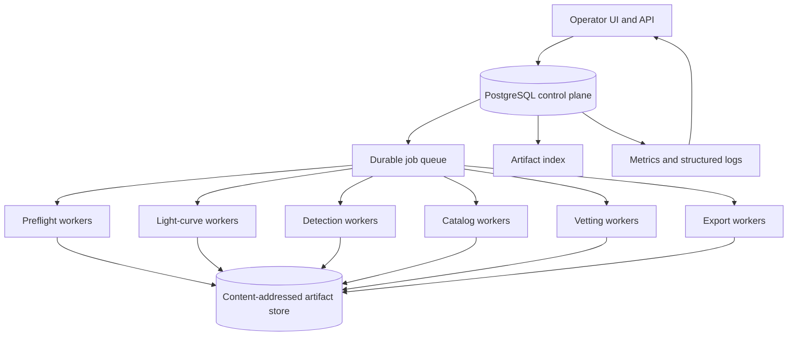
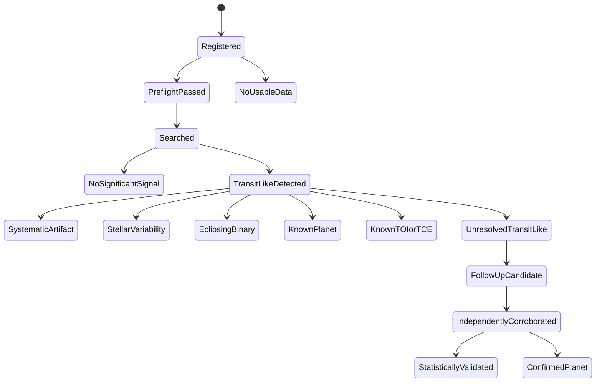

# EXOHUNT Master Research Review

## Assumptions and executive assessment

This report assumes the topic is **EXOHUNT**, because the only project-specific artifact available in this conversation is the project brief describing EXOHUNT’s goals, warning signs, required investigation, and requested report structure. I was **not** able to inspect any additional retrievable source tree, reports, logs, JSON/CSV artifacts, schemas, or tests from the project itself in this conversation, so every statement about EXOHUNT’s *current internal behavior* is separated into **verified**, **reported but not independently verified**, or **recommended/inferred**. The brief’s governing objective is clear: build a **cost-aware, sequential, scientifically defensible evidence pipeline** that promotes only unresolved transit-like signals and preserves reproducible evidence for every decision. fileciteturn0file0

The research method prioritized, in order, **official mission/archive documentation**, **peer-reviewed or original survey/pipeline papers**, and **official software or database documentation**. The most important external sources were the TESS mission and SPOC documentation, MAST HLSP pages for TESS-SPOC/QLP/TGLC/TASOC/CDIPS/PATHOS/eleanor, NASA Exoplanet Archive and ExoFOP documentation, Gaia DR3 documentation, official CDS/SIMBAD documentation, and peer-reviewed work on PDC/CBVs, TLS, EVEREST/PLD, Robovetter completeness/reliability, ExoMiner, ExoMiner++, and centroid difference imaging. citeturn0search0turn2search8turn18search1turn4search3turn18search2turn19search4turn2search2turn6search3turn5search3turn27academia45turn33search0turn26academia51turn29academia45turn31search0turn28search2turn28academia46

**Executive assessment.** In its present described state, EXOHUNT should be treated as a **diagnostic prototype, not a credible autonomous discovery system**. That conclusion follows from four converging problems. First, the available brief itself reports a survivor fraction near **25%** in a 5,000-target Sector 100 campaign, which is scientifically implausible for a properly vetoed transit-search pipeline and strongly suggests a systematic-dominated selection function. Second, official TESS documentation for **Sector 100** records camera- and orbit-specific scattered-light contamination, a new attitude-control algorithm test in the last 27 hours of the sector, and elevated pointing scatter at the start; those are exactly the kinds of sector-shared features that can create common candidate epochs if detrending and epoch-veto logic are weak. Third, the brief reports mixed scientific pipeline versions in one interrupted campaign, which invalidates any coherent completeness, reliability, or candidate-yield interpretation unless results are partitioned by exact code/config hash. Fourth, at least one identity-resolution failure is externally checkable: **TOI-1431 b / MASCARA-5 b** is a confirmed planet in the NASA Exoplanet Archive, so if EXOHUNT treated **TIC 101319448** as novel, catalog resolution is not scientifically adequate. fileciteturn0file0 citeturn25view0turn24view0turn24view3turn24view1turn7search5turn7search0

The practical implication is blunt: **a substantial rewrite is more appropriate than incremental patching**. Not a UI rewrite first, not another long campaign with a “better detrending tweak,” and not a resume-and-hope restart. The correct near-term strategy is to freeze scientific claiming, quarantine mixed-version outputs, rebuild around immutable per-target evidence bundles plus a durable event ledger, and reauthorize only a tightly bounded **diagnostic** run after catalog identity resolution, version isolation, edge/gap-safe detrending, shared-epoch vetoes, and known-object regression tests are in place. That recommendation is consistent with the way the official Kepler/TESS ecosystem separates detection products, vetting products, archival data products, and follow-up/validation products rather than collapsing them into one binary “candidate” label. citeturn0search7turn18search1turn2search1turn2search5turn29search5

A useful quantitative framing is that the requested first-pass rate of **5,000 stars/day** implies an average serial budget of only about **17.3 seconds per target** before parallelism, which means Tier 0–Tier 3 must be aggressively cheap, resumable, and artifact-aware. At the same time, the brief’s local-storage ceiling of **20,000,000,000 bytes** is only about **18.6 GiB**, whereas fully downloading a single TESS-SPOC sector can be far larger than that; MAST explicitly notes sector-scale TESS-SPOC volumes on the order of hundreds of gigabytes to terabytes depending on sector class. EXOHUNT therefore cannot be a “download-everything, recompute-everything” architecture. It has to be a **selective, cached, provenance-heavy, staged pipeline**. fileciteturn0file0 citeturn18search6turn18search3

## Verified current-state findings and scientific failure-mode analysis

**Verified from external sources.** The following are externally verifiable and relevant to diagnosing the reported behavior:

TESS **Sector 100** was a “rolled” southern mid-latitude sector with four half-orbit segments; official notes document orbit-specific Earth and Moon scattered light, guiding configuration changes, startup pointing scatter, and a new attitude-control algorithm test late in the sector. Those facts make shared candidate epochs across unrelated stars scientifically plausible if detrending and common-mode rejection are weak. citeturn25view0turn24view0turn24view1

The TESS ecosystem already provides multiple authoritative data products that EXOHUNT should treat as first-class evidence layers rather than optional afterthoughts: SPOC and TESS-SPOC light curves with SAP/PDCSAP/CBVs and DV products at MAST; QLP FFI light curves and multi-sector planet-search products; TOI/TCE catalogs via the TESS Exoplanet Vetter and NASA Exoplanet Archive; and ExoFOP-TESS as the operational follow-up repository. citeturn18search1turn4search3turn2search0turn2search1turn2search5turn0search8

Catalog resolution absolutely can fail if it is implemented naively. The external reference case named in the brief is real: **TOI-1431 b** is a **confirmed planet** in NASA’s archive. Any pipeline that misses this kind of case cannot claim robust “known-system rejection.” citeturn7search5turn7search0

Gaia DR3 is powerful but not foolproof. It includes non-single-star solutions, variability tables, RUWE and other quality indicators, but Gaia itself also documented a serious correction to its original **vari_planetary_transit** table after release. That is a good reminder that catalog cross-reference helps vetting, but catalog ingestion must itself be versioned and caveated. citeturn6search3turn6search5turn9search0turn9search5

**Reported by the brief but not independently verifiable here.** I could not independently test the following because the corresponding artifacts were not available in this conversation: the reported ~25% survivor rate from the 5,000-target campaign; candidate epoch clustering near BTJD 4074.4 and 4080.8; residual systematics after switching from TESScut to mission-processed photometry; the exact split of roughly 1,864 v2 versus 26 v3 reports; checkpoint incompatibility after code changes; missed catalog checks beyond the TOI-1431 example; dashboard rebuild costs; coordinator concurrency problems; and the exact storage-pruning behavior. Those should be treated as **hypotheses requiring forensic confirmation**, not as established facts. fileciteturn0file0

**Most likely scientific failure modes.** The pattern described in the brief is not random bad luck. The most probable explanation is an interaction between **sector-shared instrumental structure** and **over-aggressive or edge-unsafe detrending**. Savitzky–Golay filters are especially risky near boundaries and gaps because polynomial windows lose symmetry there; if transit masking is missing or fragile, the trend model can create or deepen transit-like troughs at reproducible epochs around downlinks, orbit boundaries, momentum dumps, scattered-light ramps, and masked gaps. Kepler/TESS PDC and CBV workflows were developed precisely because simple global detrenders are not robust enough for survey-grade planet searching. citeturn27academia45turn27search2turn27search6turn25view0

A second failure mode is **evidence collapse**: detection, triage, known-object resolution, false-positive rejection, and candidate promotion appear too weakly separated in the current conception. That is dangerous because a weak automated score can silently overpower strong contrary evidence from catalogs, centroid tests, or established dispositions. The published Kepler DR25 and ExoMiner/ExoMiner++ ecosystems do the opposite: they expose multiple diagnostics, document uncertainty, and measure completeness/reliability explicitly. citeturn29academia45turn1search0turn28search2turn28academia46

A third failure mode is **scientific non-reproducibility by architecture**. If checkpoints, reports, and dashboard state can be regenerated under a different pipeline version or dependency set, then a restart becomes a new experiment without saying so. In an evidence pipeline, that is a scientific error before it is a software error. This is especially serious because the brief reports mixed-version reuse inside one campaign. Recommendations below assume that every scientific decision must be attached to exact hashes for target list, code revision, dependency manifest, config bundle, source-product URIs, and catalog snapshot versions. fileciteturn0file0

### Current problems, likely causes, confirming tests, and repairs

| Current problem | Likely cause | Confirming test | Repair |
|---|---|---|---|
| Implausibly high survivor fraction | Artifact-heavy detrending and weak veto stack | Replay a locked subset with raw SAP, PDCSAP, CBV-corrected, and alternative reductions; compare survivor overlap and epoch clustering | Freeze campaign claims; require multi-reduction agreement before promotion |
| Shared BTJD clusters across unrelated stars | Sector-shared systematics, edge/gap artifacts, orbit-boundary contamination | Histogram candidate epochs by sector/camera/CCD and compare to scattered-light windows, orbit boundaries, downlinks, quality flags, and momentum-dump neighborhoods | Add common-mode epoch vetoes, edge/gap safety tests, and sector-camera artifact registries |
| Known systems missed | Weak identity graph and brittle crossmatch | Audit 500 known TOI/confirmed systems with TIC↔Gaia↔TOI↔common-name round trips | Build canonical identity graph with confidence scores and proper-motion-aware matching |
| Mixed-version campaign outputs | Mutable checkpoints and insufficient provenance | Recompute hashes for every report; cluster by code/config/dependency signatures | Quarantine mixed-version runs; never merge summaries across scientific signatures |
| Fragile resumption and coordinator races | File-based checkpoint mutation and missing leases | Chaos test with forced restarts and two coordinators | Move to durable queue + DB-backed leases + idempotent workers |
| Dashboard cost blocks science work | UI reads giant snapshots instead of query-backed state | Measure rebuild latency and I/O amplification | Replace static JSON snapshots with paginated APIs and pre-aggregated DB views |
| Local storage ceiling exceeded or at risk | Over-retention of heavy products | Track bytes by target/stage/artifact class | Keep only evidence bundles + indexed metadata locally; spill bulky raw products to remote/object storage or rehydrate on demand |

The strongest immediate scientific inference is this: if common epochs survive after moving from TESScut extraction to mission-processed photometry, then **extraction was not the only problem**. That points toward downstream event generation, detrending, or promotion logic. The official TESS documentation for Sector 100 makes this inference more credible because shared scattered-light windows and pointing changes were present in that sector regardless of which downstream user analyzed the data. fileciteturn0file0 citeturn25view0turn24view1

## Target scientific architecture and sequential vetting ladder

**Scientific mission and evidence semantics.** EXOHUNT should not use a single overloaded “candidate” label. It needs an evidence-stage model with monotonic promotion rules, so weak automated evidence cannot override stronger contrary evidence.

A workable state taxonomy is:

- **searched**: target passed identity and availability preflight; pipeline attempted valid analysis.
- **no usable data**: data absent, unusable, or quality-masked below threshold.
- **no significant signal**: search completed; no signal exceeded promotion thresholds.
- **systematic or artifact**: transit-like event explained by sector-shared, boundary, centroid, aperture, quality-flag, or model-comparison evidence.
- **likely stellar variability**: rotational, pulsational, flare, or quasi-periodic behavior better explains the light curve.
- **eclipsing-binary signature**: odd/even, secondary, depth, duration, or morphology consistent with EB/NEB.
- **known planet**: ephemeris and identity resolve to an established planet.
- **known TOI or TCE**: already present in authoritative mission candidate lists.
- **unresolved transit-like signal**: survives cheap vetoes but lacks deep validation.
- **follow-up candidate**: unresolved signal with multi-reduction and localization support.
- **independently corroborated candidate**: reinforced by another sector, reduction, or external photometry or spectroscopy.
- **validated or statistically validated planet**: supported by a formal validation framework with documented assumptions and false-positive analysis.
- **confirmed planet**: confirmed by independent observational evidence, typically RV, TTV, or other decisive follow-up. citeturn0search7turn2search0turn2search1turn16academia48turn28search1

That taxonomy keeps four concepts distinct. **Detection** means “a search statistic found a transit-like event.” **Triage** means “cheap filters removed obvious junk.” **Vetting** means “multi-diagnostic evidence argues for or against planetary origin.” **Validation** means “a probabilistic or rule-based framework made a formal planet-vs-false-positive argument.” **Confirmation** means “independent observations established the planet physically.” These are not interchangeable, and EXOHUNT should never report them as if they were. citeturn2search0turn28search1turn16academia48

The architecture above is the only practical way to satisfy both cost and scientific defensibility. The first pass must be cheap enough for 5,000 stars/day, but later tiers can be dramatically more expensive because only a small survivor fraction should reach them. This is how mature survey pipelines behave in practice: cheap search statistics first, expensive localization/context later, and formal completeness/reliability measurement as a separate layer rather than an afterthought. citeturn29academia45turn29search3turn18search1

### Pipeline tiers, costs, tests, promotion criteria, and artifacts

| Pipeline tier | Approximate cost | Main tests | Promotion criteria | Required artifacts |
|---|---:|---|---|---|
| Tier 0 Identity, availability, and quality preflight | Very low | TIC/Gaia/TOI/TCE resolution, sector availability, quality-flag summary, crowding sanity checks | Unique canonical target record and analyzable data exists | Immutable target record, identity graph edges, source URIs, quality summary |
| Tier 1 Light-curve preparation | Low | Segmentation by orbit/gap, edge-safe masking, CBV/common-mode options, robust outlier handling | Prepared curves from at least one authoritative reduction | Prepared light curves, detrending configs, masks, residual diagnostics |
| Tier 2 Initial detection | Low to moderate | BLS, TLS, single-event search; optional residual iterative search | Signal exceeds calibrated threshold in at least one prepared curve | Search result object, period grid, SDE/SNR metrics, folded/unfolded plots |
| Tier 3 Cheap physical and statistical vetoes | Low | odd/even, secondary, duty cycle, duration plausibility, red-noise adjusted significance, alias checks | Survives all cheap vetoes without known-object match | Veto report, failed-rule evidence, ephemeris record |
| Tier 4 Independent reduction and multi-sector coherence | Moderate | Agreement across SPOC/QLP/TGLC/other authorized products, sector-to-sector ephemeris coherence | Reproducible signal across independent reductions or sectors | Cross-reduction comparison packet, coherence metrics |
| Tier 5 Pixel localization and centroid analysis | Moderate to high | difference images, centroid offsets, aperture growth, nearby-source tests | Event likely on-target or unresolved within tolerance | Difference-image products, centroid offsets, localization verdict |
| Tier 6 Deep catalog and context vetting | Moderate network cost | TOI/TCE/confirmed planets, EBs, variable-star catalogs, Gaia RUWE/NSS/variability, spectroscopy/imaging holdings | No strong contrary evidence and no existing authoritative disposition | Crossmatch bundle, catalog snapshot versions, contextual verdict |
| Tier 7 Injection-recovery and reliability context | High batch cost | regime-specific completeness and reliability estimate, false-alarm modeling | Candidate sits in a scientifically acceptable regime with measured uncertainty | Injection maps, ROC/PR metrics, reliability context record |
| Tier 8 Human review and follow-up queue | Human-limited | narrative review, rank by value-of-information, follow-up feasibility | Explicit sign-off for follow-up queue | Final survivor bundle, audit trail, export object |

**Expected attrition.** Tier 0–Tier 3 should eliminate the overwhelming majority of targets. If Tier 3 is passing anything like 25% of analyzed stars, something is broken. For a healthy production pipeline, a reasonable planning target is **well under 1%** surviving past Tier 3, with Tier 4–Tier 6 reducing that by another order of magnitude before any operator sees a true follow-up queue. That specific percentage is a design target here, not an externally measured EXOHUNT fact. It is motivated by the rarity of bona fide unresolved transit-like events and by published survey experience that catalog reliability collapses when low-SNR, long-period, or systematic-dominated regimes are not strongly filtered. citeturn29academia45turn29academia44turn33search2

**Recommended detection mix.** TLS should be the default small-planet periodic search because it uses a physically motivated transit shape and is generally more sensitive than BLS for shallow events, while BLS still has value as a cheap complementary baseline and for diagnostic disagreement tests. Single-event searches are worth adding, but only after the core periodic pipeline is made trustworthy. TTV-aware or quasi-periodic searches are promising for later stages, not for the cheap first pass. citeturn33search0turn1academia51

## Data-source and catalog matrix

The right catalog strategy is **not** “query everything for every star.” It is a staged identity-and-context graph in which each source is used because it changes a decision. EXOHUNT should separate sources into **cheap triage**, **deeper vetting**, and **follow-up context**, and it should cache result snapshots with explicit versions because several of these resources are living services. Official availability and release status of the sources below were checked during this research. citeturn18search1turn4search3turn18search2turn19search4turn2search2turn6search3turn5search3

**Canonical identity graph rules.** The anchor should be a **canonical object node** keyed internally by immutable EXOHUNT UUID, not by TIC alone. Each incoming identifier becomes an attached edge with a source, confidence, version, and last-verified timestamp. Crossmatch order should usually be **TIC → Gaia → SIMBAD/common names → TOI/TCE/ExoFOP → mission-specific IDs**. Cone matches should be proper-motion-aware when Gaia is present, especially for older surveys like 2MASS and Tycho. When multiple plausible neighbors exist inside one TESS pixel or aperture footprint, EXOHUNT should preserve that ambiguity instead of forcing a single identity. That is crucial for centroid and contamination logic. The need for this approach is reinforced by TGLC’s Gaia-prior deblending design and by published work on positional probability and host-star identification for TESS candidates. citeturn18search2turn3academia49turn31academia48turn7search7

### Catalog and source matrix

| Catalog or source | Scientific purpose | Access and current status | Caching strategy | Failure semantics |
|---|---|---|---|---|
| SPOC 2-minute and 20-second products | Official mission light curves, pixels, DV for preselected targets | MAST official mission archive and TESS docs; current and authoritative for mission products citeturn0search7turn2search8 | Cache metadata and only target-specific files on demand | Missing product means unavailable target/cadence, not “no planet” |
| TESS-SPOC FFI HLSP | Official SPOC FFI target products, SAP/PDCSAP/CBVs/DV; updated 2026-07-23 | MAST HLSP, active release stream citeturn18search1 | Cache target lists locally; lazy-fetch products per survivor | Absence of DV means no detected TCE in that product stream |
| QLP | Fast FFI pipeline, multi-aperture photometry, multi-sector search | TESS/MAST official QLP pages; active through recent sectors citeturn4search0turn4search3 | Cache sector target manifest + summary metrics | Coverage limited by QLP target rules and brightness cuts |
| TESScut | Controlled fallback for custom FFI cutouts | Official MAST API, active citeturn0search2 | Use only on escalation paths; cache manifests, not all cutouts | Cutout failure or poor extraction is not evidence of no signal |
| TGLC | Gaia-prior PSF deblending, strong contamination control | Active MAST HLSP, updated 2025-12-07 citeturn18search2turn3academia49 | Cache derived summary metrics and fetch light curves only for ambiguous/crowded cases | Absence usually means no product coverage, not target invalidity |
| eleanor | Community FFI extraction baseline | MAST HLSP available; original HLSP static/older release citeturn19search0 | Use only as comparison product for selected cases | Older pipeline means good diagnostic control, not primary authority |
| PATHOS | PSF-based cluster photometry | MAST HLSP available, cluster-focused citeturn18search4 | Restrict to cluster-member edge cases | Noncoverage expected for general field stars |
| CDIPS | Young stars / cluster-member photometry | MAST HLSP active through DR6 citeturn19search3 | Query only for youth/cluster contexts | Negative match does not imply field status certainty |
| TASOC | Corrected light curves including ensemble and CBV variants | MAST HLSP active; TASOC website itself warns its web pages are not actively maintained citeturn19search4turn3search1 | Use for variability-rich stars and diagnostic disagreement | Some access/documentation paths may be stale |
| NASA Exoplanet Archive | Confirmed planets, candidate tables, APIs, completeness products | Official NASA archive, active in 2026 citeturn7search4turn29search5 | Snapshot key tables by date/version for campaign reproducibility | Living catalog; dispositions can change |
| TEV / TOI / TCE catalogs | TESS project source-of-truth workflow for TOIs/TCEs | Official TESS Science Office TEV docs, active citeturn2search0 | Mirror nightly or daily snapshots for campaign consistency | “Living document” semantics; stale local copy is dangerous |
| ExoFOP-TESS | Follow-up repository, observer notes, imaging/spectroscopy metadata | Official NExScI service, active citeturn2search5turn0search8 | Cache structured fields and URLs, not community-uploaded heavy files by default | User-contributed content varies in completeness and vetting level |
| Villanova TESS EB catalog | High-value EB rejection | MAST HLSP and Villanova-hosted live catalog citeturn4search4turn4search6 | Mirror catalog table locally | Catalog incompleteness possible outside covered regimes |
| Gaia DR3 | Astrometry, proper motions, RUWE, NSS, variability, neighbors | Official ESA archive/docs, active; planetary-transit table had a corrected re-release citeturn6search3turn6search5turn9search0 | Local campaign snapshot by release/version; never mix | Some tables have known-issue history; version pinning mandatory |
| SIMBAD | Identifier resolution, bibliography, object context | Official CDS service, active; explicitly *not* a catalog citeturn5search3 | Cache resolved IDs and bibliographic links | Do not use as sole truth source for population tables |
| VizieR | Published catalog access across many surveys | Use selectively through CDS/VizieR ecosystem; treat as source registry, not first-pass dependency citeturn5search3 | Prefer targeted mirrored catalogs, not live-firehose querying | Heterogeneous provenance; easy to over-query with little value |
| ZTF | Ground-based variability and long-baseline context | Official public-release system active in 2026; alerts real-time, releases staged citeturn9search1turn9search7 | Cache summary stats and request light curves only for promoted targets | Survey cadence/filter system differ from TESS |
| ASAS-SN | Bright-star variability and EB/rotator context | Public database and catalogs, widely used; all-sky cadence ~2–3 d in V and deeper g-band work exists citeturn10search2turn10academia50 | Query only for promoted targets | Sparse cadence relative to transit durations; mainly context source |
| ATLAS | Experimental forced photometry and variability context | Official ATLAS project; forced-photometry server is public but experimental and large-volume requests are discouraged citeturn11search0turn11academia27 | Use sparingly for special cases | Do not build core throughput assumptions on it |
| HST/JWST metadata | Follow-up context only, never discovery proof | Public archive metadata are searchable via MAST/JWST archives citeturn21search0turn21search4turn21search7 | Cache only program metadata references | Existence of holdings does **not** imply planet evidence |

**Cheap triage sources.** Tier 0 and Tier 3 should primarily rely on TIC/Gaia/TOI/TCE/confirmed planets, official mission quality flags, and one or two strong EB/variability catalogs. Everything else should be opt-in by escalation. That keeps rate, latency, and false-match risk under control. citeturn2search0turn7search4turn4search4turn6search3

**Deep vetting sources.** Tier 4–Tier 6 should add TGLC, ExoFOP-TESS, SIMBAD/VizieR-targeted lookups, Gaia variability/NSS/RUWE, and selected ground-based surveys when those sources have clear decision value. Published high-resolution imaging, spectroscopy, and stellar characterization are especially valuable when already linked through ExoFOP or archive metadata. citeturn18search2turn2search5turn6search3turn5search3turn9search1turn10search2

## Signal-processing, vetting, and measurement framework

**Signal-processing overhaul.** The core design principle should be: **no single detrending method silently defines the entire candidate population**. EXOHUNT should run an **ensemble of detrenders** for promoted targets, and a smaller but still plural set for Tier 1. At minimum, the cheap stack should include raw-or-lightly-prepared SAP-style flux, an official mission-corrected product when available, and a regression/CBV-based correction that can be diagnosed. More expensive stages can add PSF/deblended reductions like TGLC, PLD-style methods where pixels are available, and GP-based variability models for active stars. Kepler PDC/CBV, EVEREST PLD, K2SC GP detrending, and Lightkurve’s corrector framework all point in the same direction: systematic removal must preserve transits, expose diagnostics, and be chosen with explicit tradeoffs. citeturn27academia45turn26academia51turn26academia48turn27search0turn27search5

Why do common candidate epochs arise across unrelated stars? Because survey spacecraft imprint **shared time structure**. In TESS that includes orbit boundaries, scattered-light ramps, downlinks, guiding changes, momentum dumps, start-of-orbit settling, and quality-flagged cadences. If a detrending function overfits local curvature near one of those events, it can create many transit-like minima at the same timestamps. Sector 100 is exactly the sort of sector where this must be expected, not waved away. citeturn25view0turn24view1turn22search0

A scientifically defensible Tier 1 preparation stack should include:

- orbit and gap segmentation before detrending;
- conservative masking around sector boundaries and long gaps;
- explicit transit masking during iterative detrending;
- quality-flag-aware exclusion rather than blind interpolation;
- residual common-mode diagnostics at the sector-camera-CCD level;
- side-by-side storage of at least two independently prepared curves for any survivor; and
- red-noise metrics, not just white-noise RMS. citeturn27academia45turn27search6turn25view0

**Recommended production-ready versus experimental methods.**  
Production-ready: quality masking, segmentation by orbit/gap, CBV/regression-based correction, robust splines with transit masking, multi-aperture comparison, odd/even and secondary tests, centroid/difference imaging, ephemeris matching, Gaia contamination checks, and injection/recovery characterization. citeturn27academia45turn31search0turn29search3

Near-term experimental: PLD on selected FFI cutouts, GP detrending for active stars, probabilistic positional host-ranking, ExoMiner++/Astronet-like triage as an auxiliary score, and limited single-transit search. citeturn26academia51turn26academia48turn31academia48turn28academia46turn31academia50turn33search1

Longer-term research: TTV-aware automated search, hierarchical Bayesian candidate ranking, active learning for review allocation, broad anomaly detection, and value-of-information planning for follow-up. The literature supports these as promising directions, but not yet as the central discovery spine for a fragile early-stage production pipeline. citeturn28academia47turn32academia46turn32academia47

**Transit vetting and false-positive rejection.** The cheapest veto stack should include odd/even depth comparison, secondary search, cadence-aware duration plausibility, duty cycle plausibility, minimum-transit-count logic, local red-noise-adjusted significance, harmonic and alias checks, sector-to-sector ephemeris coherence, and ephemeris matching against TOI/TCE/EB/known-planet tables. For promoted signals, add difference images, PRF/centroid localization, aperture-growth testing, nearby-source transit tests, and cross-reduction depth consistency. Difference imaging and centroid analysis are not luxury add-ons; they are part of survey-grade DV practice. citeturn31search0turn29search6turn2search0turn4search4

**Machine learning.** ML adds real value in **triage and prioritization**, especially when label volume is huge. QLP/Astronet-style triage and ExoMiner++-style vetting can reduce human load and improve ranking. But they should never be allowed to create discovery claims by themselves. The two main risks are **label leakage** from mission dispositions and **domain shift** between sectors, cadences, reductions, and crowdedness regimes. EXOHUNT should therefore require that every ML score be accompanied by physically interpretable diagnostics that would still be useful if the ML model disappeared tomorrow. citeturn31academia51turn31academia50turn28search2turn28academia46

**Injection/recovery and reliability.** EXOHUNT should explicitly measure two different things: **detection completeness** and **catalog reliability**. Kepler DR25 is still the best public template for this discipline. Its automated catalog was characterized using injected transits and simulated/systematic false alarms, and the published reliability varied dramatically by regime: the easy short-period regime was strong, while low-SNR longer-period regimes were much less reliable. EXOHUNT should learn from that rather than assume one threshold works uniformly across all stars and periods. citeturn29academia45turn29search3turn29academia44

EXOHUNT’s injection grid should span stellar magnitude/type, variability class, transit depth, period, duration, impact parameter, observed-transit count, sector coverage, crowding, reduction family, and detrending configuration. Known planets, known false positives, and eclipsing binaries should be split into at least three disjoint sets: **characterization**, **regression**, and **blind evaluation**. Blinded synthetic injections are essential because otherwise the team will unconsciously overfit to the known catalog. citeturn29search3turn1search0

## Durable operations architecture, migration roadmap, and decisions

**24/7 systems architecture.** EXOHUNT should move from mutable campaign checkpoints plus dashboard-centered state into a **database-backed, append-only evidence system**. The recommended minimum durable architecture is a PostgreSQL-backed control plane with immutable per-target job records, append-only event ledgers, content-addressed artifact storage, separate worker pools for download/analysis/catalog/vetting/export, advisory-lock-based campaign leases, idempotency keys for all stage transitions, and strict scientific-signature partitioning. PostgreSQL’s advisory locks and transaction semantics are well suited to exclusive campaign leases and atomic state transitions; SQLite is excellent for embedded use, but its file-level write model and exclusive-writer constraints make it a bad core coordinator database for a months-long, multi-worker scientific service. citeturn12search0turn13search0turn13search1

A workflow engine is justified here. If the team wants the smallest surface area, a DB-backed queue plus carefully written workers is enough. If it wants stronger crash recovery and long-lived orchestration semantics, a durable workflow system is better. Temporal’s core value proposition is exactly the one EXOHUNT needs: workflows resume after crashes and network failures without losing state. That is more aligned with a months-long evidence pipeline than ad hoc Python coordinators or giant mutable checkpoints. citeturn15search0

**Proposed state machine and data model.** Every target-stage execution should create a new immutable record rather than mutating the old one. The core tables should include `campaign`, `target`, `identity_edge`, `source_product`, `job`, `job_attempt`, `event_ledger`, `artifact`, `signal`, `signal_evidence`, `crossmatch_result`, `review_action`, and `scientific_signature`. The **scientific signature** should be a cryptographic digest over code revision, dependency lockfile, pipeline config, target list hash, and source snapshot versions. Campaign summaries should group only records with identical scientific signatures. That one rule would prevent the mixed-version confusion reported in the brief. fileciteturn0file0

**Dashboard and API redesign.** The current dashboard may be attractive, but EXOHUNT should optimize for **operational truth**, not aesthetic survivor cards. The UI should become a thin projection over query-backed APIs. It should show campaign scientific signature, queue depth, failure rates, by-tier attrition, bytes on disk, cache hit rates, source coverage, common-mode epoch diagnostics, completeness/reliability estimates by regime, and full evidence drill-down per target. Giant static JSON files and full-browser rendering of campaign outputs should be retired. MAST and archive ecosystems themselves already model this separation between indexed metadata, on-demand product retrieval, and curated higher-level tables. citeturn18search1turn2search2turn21search1

### Architecture choices

| Architecture choice | Main alternatives | Recommendation | Tradeoffs |
|---|---|---|---|
| Core control-plane database | SQLite, PostgreSQL | **PostgreSQL** | More operational overhead than SQLite, but much better concurrency, locking, leases, and auditability citeturn12search0turn13search0turn13search1 |
| Orchestration | Hand-rolled coordinator, Celery/Prefect-style queueing, Temporal-style durable workflows | **DB queue first; Temporal if long-lived orchestration complexity grows** | Simpler queue is faster to ship; durable workflow engine is stronger for crash-safe resumptions citeturn15search0turn14search0 |
| Artifact storage | Mutable per-target dirs, content-addressed store | **Content-addressed immutable artifacts** | Requires hashing and index discipline, but stops silent overwrites |
| Campaign ownership | File locks, DB leases | **DB advisory lease + heartbeat expiry** | Needs careful lease renewal logic, but prevents duplicate coordinators citeturn12search0 |
| Result summaries | Re-scan filesystem on demand, materialized DB views | **DB views/materialized aggregates** | Slight write-path cost, major read-path speedup |
| Local storage | Keep all products locally, selective caching + rehydration | **Selective caching + remote/object spill** | Slight re-fetch latency, but compatible with 20 GB ceiling fileciteturn0file0 citeturn18search6 |
| Candidate ranking | Single scalar score, evidence bundle + score | **Evidence bundle first, score second** | Slightly more complex UI, much safer scientific semantics |

**Testing and release discipline.** No new large campaign should be authorized just because unit tests pass. The required test pyramid should include synthetic light-curve unit tests, known-object regression sets, blinded injection/recovery, catalog-contract tests, network-failure simulation, duplicate-coordinator tests, idempotent resume tests, storage-ceiling tests, API/dashboard contract tests, cross-version migration tests, and multi-day soak tests. Kepler’s completeness/reliability culture is again the right model here: you do not know your catalog until you have measured how it behaves under controlled injections and false alarms. citeturn29search3turn29academia45

**Migration roadmap.** The first principle is containment: do not continue scientific production on the current architecture while the evidence model is untrustworthy.

### Milestones, deliverables, acceptance tests, and effort

| Milestone | Deliverables | Acceptance tests | Estimated effort |
|---|---|---|---|
| First 72 hours | Freeze scientific claims; quarantine mixed-version outputs; snapshot raw evidence; write forensic inventory | Every extant output tagged as trusted, diagnostic, quarantined, or discardable | 2–4 engineer-days |
| First two weeks | Canonical identity graph; scientific-signature hashing; append-only ledger; known-object regression set; common-epoch diagnostic report | TOI-1431 and curated known-object set resolve correctly; mixed-version reuse impossible in new runs | 2–3 engineer-weeks |
| First 30 days | Tier 0–Tier 3 rewrite; edge/gap-safe detrending; cross-reduction comparison; query-backed dashboard MVP | Locked 500-target diagnostic run completes reproducibly with no epoch pileups and documented attrition | 4–6 engineer-weeks |
| 30–90 days | Tier 4–Tier 6 deep vetting; centroid/difference-image tooling; storage pruning; durable queue/leasing | Restart, lease, and duplicate-coordinator chaos tests pass; survivor bundles are reproducible and auditable | 6–10 engineer-weeks |
| 90–180 days | Tier 7 injection/recovery and reliability layer; campaign-scale API and observability; human review workflow | Completeness/reliability maps exist for at least one scientifically meaningful regime | 8–12 engineer-weeks |
| Longer-term research | Single-transit, TTV-aware search, ML-assisted review allocation, probabilistic validation extensions | Experimental features are isolated from production candidate claims | Ongoing |

**Prioritized backlog.** Ranked by expected **scientific value divided by implementation risk/cost**, the top ten changes are:

| Rank | Change | Scientific value | Risk or cost | Priority judgment |
|---|---|---:|---:|---|
| 1 | Canonical identity graph with versioned crossmatches | Very high | Moderate | Do immediately |
| 2 | Scientific-signature hashing and mixed-version quarantine | Very high | Low | Do immediately |
| 3 | Shared-epoch/common-mode diagnostics and vetoes | Very high | Low to moderate | Do immediately |
| 4 | Edge/gap-safe detrending with explicit transit masking | Very high | Moderate | Do immediately |
| 5 | Immutable per-target evidence bundles and append-only ledger | Very high | Moderate | Do immediately |
| 6 | DB-backed campaign leases and idempotent workers | High | Moderate | Early |
| 7 | Cross-reduction agreement requirement before promotion | High | Moderate | Early |
| 8 | Known-object regression and catalog-contract suite | High | Low | Early |
| 9 | Query-backed dashboard/API replacing giant snapshots | Medium | Moderate | After control-plane repair |
| 10 | Injection/recovery and explicit reliability measurement | Very high | High | Start design early, ship after core rewrite |

### Risk register

| Risk | Likelihood | Impact | Mitigation | Detection signal |
|---|---|---|---|---|
| Another long campaign produces unusable science | High | Very high | Freeze large campaigns until release gates pass | Survivor fraction or shared-epoch spikes |
| Catalog false negatives hide known systems | High | High | Canonical identity graph + regression set | Missed known TOIs/confirmed planets |
| Duplicate coordinators corrupt state | Medium | High | DB leases + heartbeats + idempotency keys | Two active lease holders or duplicate stage starts |
| Mixed-version summaries return | High without controls | Very high | Scientific signatures and partitioned aggregations | Same campaign ID contains multiple signature hashes |
| Storage ceiling breached | Medium | High | Byte accounting + retention tiers + spillover | Disk headroom below policy threshold |
| ML score abused as proof | Medium | High | Policy: ML only assists triage/ranking | Reports show unsupported “planet probability” claims |
| Dashboard becomes source of truth instead of DB | High | Medium | Read-only API projection model | UI count mismatches against DB |
| Archive or catalog service instability blocks pipeline | Medium | Medium | Caching, circuit breakers, retry budgets | Elevated external-call failure rate |
| Overfitting to known regression set | Medium | Medium | Blind injections and held-out sectors | Good regression metrics but poor blind-run behavior |
| Human review becomes bottleneck too early | Medium | Medium | Better automatic attrition before Tier 8 | Tier 8 queue grows faster than review capacity |

**Open scientific and engineering decisions.** The main unresolved choices are not about front-end aesthetics. They are: whether to adopt a full durable workflow engine immediately or after the DB-backed queue stabilization; how much of Tier 4 cross-reduction comparison must be mandatory for promotion; whether to keep TESScut fallback in production Tier 4 or only in forensic mode; and what exact reliability threshold must be met before a signal can enter “follow-up candidate” state. Those decisions should be made only after the first rewritten diagnostic run and its injection/recovery characterization.

## Prioritized bibliography

The sources below are the most important **primary or authoritative** references for rebuilding EXOHUNT. Publication/update timing is included when clearly available from the source itself.

**Mission and archive foundations**

1. **TESS Science Processing Operations Center and TESS data product documentation** — official TESS/NASA documentation describing SPOC, TCEs, DV products, and science data products. Updated official documentation pages and technical memo. citeturn0search0turn2search8turn0search7  
2. **TESS-SPOC FFI HLSP at MAST** — official MAST HLSP page, updated **2026-07-23**, including SAP/PDCSAP/CBV/DV products and FFI multi-sector-search notes. citeturn18search1  
3. **QLP official pages and MAST HLSP** — official TESS/MAST sources describing multi-aperture FFI photometry and multi-sector QLP search flow; MAST HLSP updated **2025-07-20**. citeturn4search0turn4search3  
4. **NASA Exoplanet Archive and TESS Project Candidates documentation** — official archive pages for confirmed planets, TOIs, APIs, and TESS mission candidate semantics. citeturn7search4turn2search1turn2search2  
5. **ExoFOP-TESS official documentation and DOI page** — authoritative follow-up repository description. citeturn2search5turn0search8  
6. **Condensed TESS Data Release Notes and Sector 100 notes** — official sector-specific operational caveats; essential for diagnosing shared epochs in the reported campaign. citeturn25view0turn24view0turn24view1

**Alternative reductions and context data**

7. **TGLC official MAST HLSP** — active, updated **2025-12-07**; PSF-based, Gaia-prior deblended FFI light curves. citeturn18search2turn3academia49  
8. **TASOC, CDIPS, PATHOS, eleanor MAST HLSP pages** — authoritative release-status and access pages for important comparison products. citeturn19search4turn19search3turn18search4turn19search0  
9. **Gaia DR3 documentation and known issue pages** — official ESA documentation on NSS, variability, RUWE, and corrected planetary-transit table. citeturn6search3turn6search5turn9search0  
10. **SIMBAD official homepage** — critical caveat that SIMBAD is not itself a catalog, but an identifier and bibliography resolver complementary to VizieR. citeturn5search3  
11. **Villanova TESS Eclipsing Binary Catalog at MAST** — authoritative EB rejection source. citeturn4search4turn4search6  
12. **ZTF public data release page, ASAS-SN survey/catal​​og papers, and ATLAS official project page** — important external variability context. citeturn9search1turn10search2turn10academia50turn11search0

**Survey-grade detection, detrending, and vetting**

13. **Smith et al. 2012, Kepler PDC MAP** — foundational paper on Bayesian cotrending basis vectors and systematic correction. citeturn27academia45  
14. **Hippke and Heller 2019, TLS** — peer-reviewed TLS detection method. citeturn33search0  
15. **Luger et al. 2016, EVEREST / PLD** — pixel-level decorrelation with injection/recovery validation. citeturn26academia51  
16. **Aigrain et al. 2016, K2SC** — GP-based simultaneous systematics and variability modeling. citeturn26academia48  
17. **Twicken 2019, Difference Imaging and Centroid Analysis** — official NASA technical publication describing DV difference imaging and centroid methodology. citeturn31search0  
18. **Mullally et al. 2016, Identifying False Alarms in the Kepler Planet Candidate Catalog** — automated rejection of systematic false alarms using model comparison. citeturn29search6turn33search2

**Completeness, reliability, and ML-assisted vetting**

19. **Kepler DR25 automated catalog and reliability/completeness work** — the best publicly documented template for measuring survey behavior, including regime-dependent reliability. citeturn29academia45turn29academia44turn29search3  
20. **ExoMiner and ExoMiner++ official NASA summaries and original papers** — useful for ML-assisted triage/vetting, but only as evidence alongside physics-aware diagnostics. citeturn28search1turn28search2turn28academia46turn28academia49  
21. **Astronet / TESS deep-learning triage papers** — useful for ranking and load reduction, not self-sufficient scientific proof. citeturn31academia51turn31academia50

**Durable systems design**

22. **PostgreSQL advisory-lock documentation** — authoritative reference for campaign leases and concurrency control. citeturn12search0  
23. **SQLite locking and isolation documentation** — authoritative reasons not to use SQLite as the central concurrent scientific coordinator. citeturn13search0turn13search1  
24. **Temporal official documentation** — authoritative durable-execution reference if the project adopts a workflow engine. citeturn15search0

**Final decisions**

1. **Can the current system support credible discovery claims?**  
   **No.** On the available evidence, it should not support credible autonomous discovery claims. At best it can support forensic and diagnostic work while the science and control-plane architecture are rebuilt. fileciteturn0file0 citeturn25view0turn7search5

2. **Smallest repair that would make another 5,000-target diagnostic run scientifically worthwhile.**  
   Freeze code and dependencies; quarantine all mixed-version outputs; implement scientific-signature hashing; add canonical identity resolution; replace single detrending with at least one official product plus one alternative correction; add shared-epoch diagnostics and vetoes; and run a **locked** 500–1,000 target diagnostic subset with curated known-object regression before scaling back to 5,000. That is the smallest repair worth doing; anything less risks producing another uninterpretable result. fileciteturn0file0 citeturn18search1turn4search3turn25view0turn29academia45

3. **Minimum conditions for authorizing a 50,000-target or continuous campaign.**  
   The project must have immutable evidence bundles, DB-backed leases, idempotent resumes, version-partitioned summaries, known-object regression success, common-mode diagnostics with acceptable behavior, measured injection/recovery maps for at least one production regime, and explicit release gates signed off by both engineering and science reviewers. Without those, scaling up only magnifies false positives and irreproducibility. citeturn12search0turn29search3turn29academia45

4. **Top ten changes ranked by scientific value divided by implementation risk/cost.**  
   The ranking is: identity graph; scientific signatures; shared-epoch vetoes; edge/gap-safe detrending; immutable evidence bundles; DB-backed leases/idempotency; cross-reduction agreement requirement; known-object regression suite; query-backed dashboard/API; injection/recovery and reliability layer.

5. **Recommended build, validate, then scale master sequence.**  
   Build the evidence/control plane first. Then validate identity resolution and known-object rejection. Then validate detrending and shared-epoch behavior on a locked subset. Then measure injection/recovery and reliability. Then run a 5,000-target diagnostic campaign. Only after that should the project discuss 50,000-target or continuous operation. citeturn29academia45turn29search3

6. **Project behaviors that must be prohibited.**  
   Prohibit code changes during active campaigns; prohibit mixed-version summary aggregation; prohibit mutable evidence overwrites; prohibit dashboard-derived status as the source of truth; prohibit issuing “candidate” labels without explicit evidence stage; prohibit archive-firehose querying without cache policy; prohibit claiming that a restart is the same experiment if hashes changed; prohibit ML-only promotion; and prohibit long campaigns launched without injection/recovery and regression gates. fileciteturn0file0

7. **Claims the dashboard and reports must never make without stronger evidence.**  
   They must never say or imply **“planet discovered,” “planet candidate,” “validated planet,” “confirmed planet,” “novel object,” “not previously known,”** or **“statistically significant astrophysical signal”** unless the relevant evidence stage has been formally satisfied. They also must never treat catalog metadata, ExoFOP holdings, HST/JWST program presence, or ML scores as proof of planetary nature. citeturn21search0turn21search4turn28search2turn16academia48